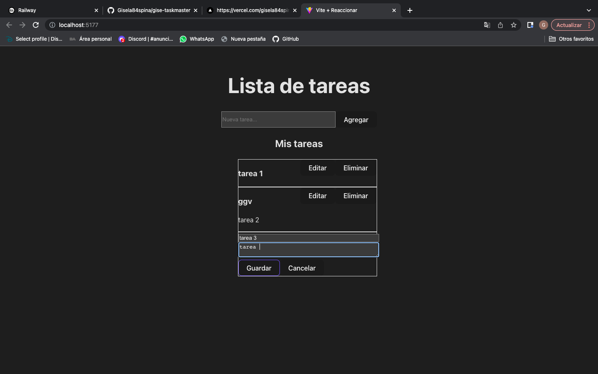

# Aplicación de Lista de Tareas

## Descripción
Esta es una aplicación básica de lista de tareas que permite a los usuarios crear, leer, actualizar y eliminar tareas. Está construida con Node.js y Express en el backend, y React con Vite en el frontend.

## Tecnologías Utilizadas
- **Backend**: Node.js, Express
- **Frontend**: React, Vite
- **Almacenamiento**: Array en memoria (temporal)
- **Estilos**: TailwindCSS

## Instrucciones para ejecutar la aplicacion
 1- Instalacion de dependencias: en la carpeta Backend click derecho y buscar abrir la terminal, una vez en la terminal de la carpeta Backend escribe el comando: npm install y enter
 2- Inicio del servidor: node server.js

 3- Al igual que el paso 1, pararse en la carpeta Frontend, click derecho, buscar abre terminal y una vez ahi escribe comando: npm install
 4- Finalmente escribe comando: npm run dev y entrar al localhost con crtl y click o command y click si estas con una Mac.

# Endpoints de la API
GET /api/tasks: Obtiene todas las tareas.
POST /api/tasks: Crea una nueva tarea. Cuerpo: { "title": "Título", "description": "Descripción" }
PUT /api/tasks/:id: Actualiza una tarea existente. Cuerpo: { "title": "Nuevo Título", "description": "Nueva Descripción" }
DELETE /api/tasks/:id: Elimina una tarea. 

Abre la imagen con Ctrl+Shift+V o Cmd+Shift+V
